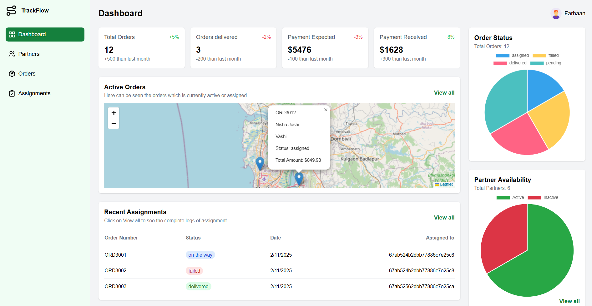
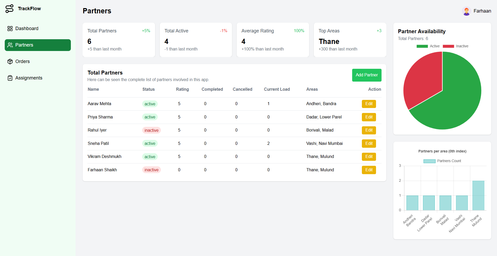
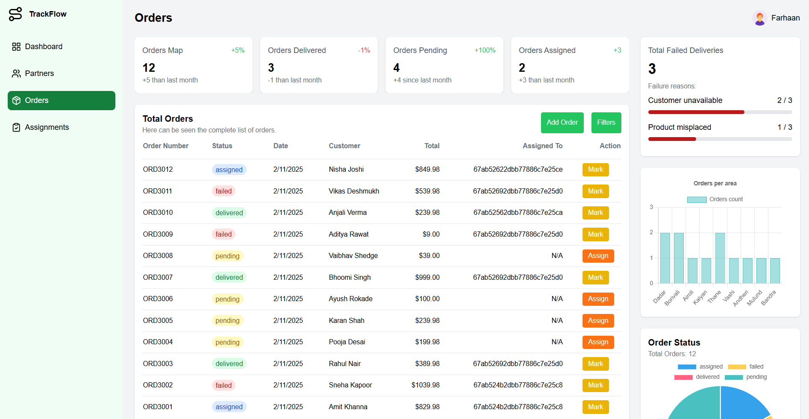
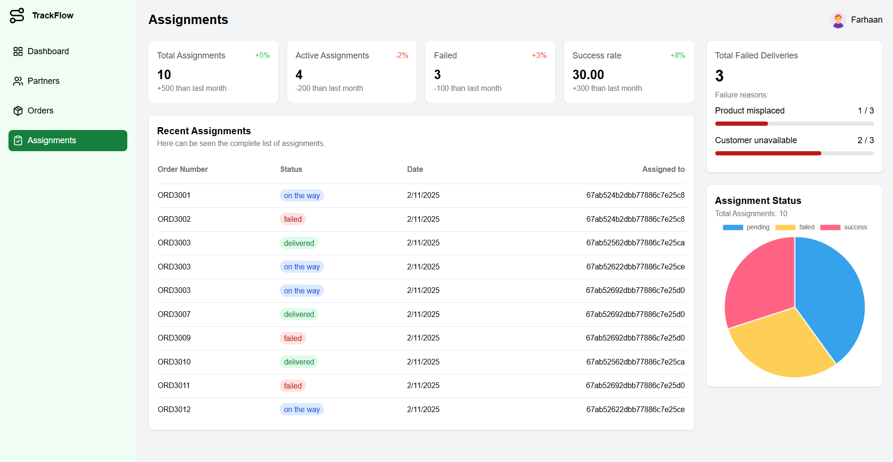
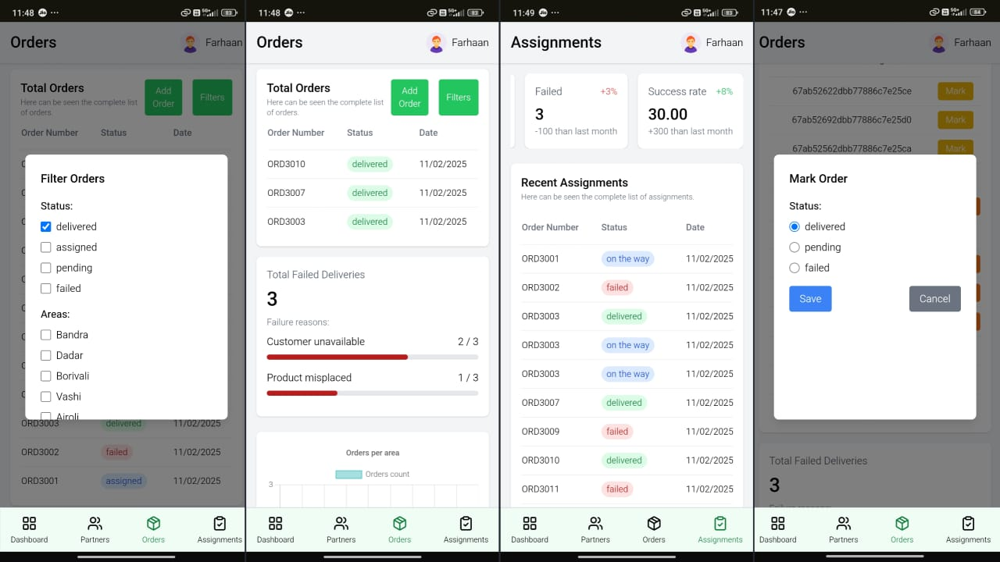
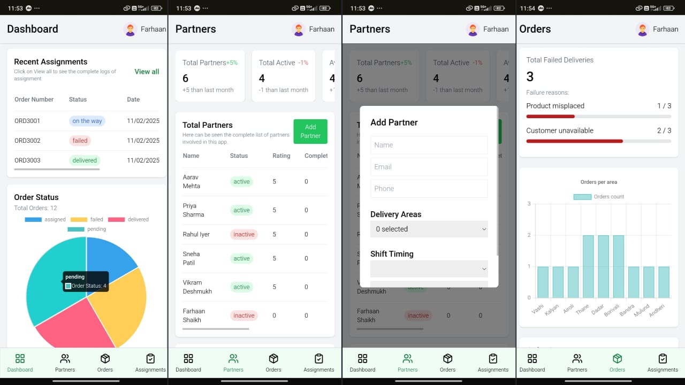

---

# 📦 Smart Delivery Management

## 📖 Description

🚀 **Introducing Smart Delivery Management: The Ultimate Solution for Efficient Delivery Handling!** 🚚💾

Managing orders, tracking deliveries, and ensuring seamless logistics has never been easier! **Smart Delivery Management** is designed to streamline the entire delivery process, providing a user-friendly experience for businesses and customers alike.

## ✨ Key Features

- 📅 **Order Tracking**: Real-time tracking of all orders and deliveries.
- 🌐 **Admin & Delivery Panel**: Dedicated sections for managing deliveries efficiently.
- 📈 **Analytics Dashboard**: View performance metrics and optimize logistics.
- 📍 **Delivery Assignment**: Assign delivery personnel to specific orders easily.
- 📢 **Live Status Updates**: Drivers can update the order status live, keeping customers informed.

## 🛠️ Installation

1. **Clone the repository**:
    ```bash
    git clone https://github.com/FSfarhaan/Smart-Delivery-Management-System
    ```
2. **Navigate to the project directory**:
    ```bash
    cd Smart-Delivery-Management-System
    ```
3. **Install dependencies**:
    ```bash
    npm install
    ```
4. **Start the development server**:
    ```bash
    npm run dev
    ```

## 🌍 Tech Stack

- **Frontend**: Next.js, Typescript, Tailwind CSS
- **Backend**: Next.js
- **Database**: MongoDB (with Mongoose ODM)

## 📸 Screenshots

<!-- Add screenshots of your app here. Example: -->







---

## 📚 API Documentation

Below are the details of the API routes used in the Smart Delivery Management system. All endpoints return JSON responses.

### Base URL
```
https://api.smartdelivery.com/v1
```

### Endpoints

#### 1. **Partners**
- **GET `/api/partners`**: Fetch all Partners.
- **GET `/api/partners/getAreas`**: Fetch areas and count related to partners to enter in the graph.
- **POST `/api/partners`**: Add a new partner.
- **PUT `/api/partners/[id]`**: Update partner's details.
- **DELETE `/api/partners/[id]`**: Remove a partner.


#### 2. **Orders**
- **GET `/api/orders`**: Fetch all orders.
- **GET `/api/orders/getOrdersLoc`**: Fetch Coordinates of the entered location. eg: Vashi.
- **GET `/api/orders/getById/[id]`**: Fetch ORDNUM by entering MongoDb _id.
- **GET `/api/orders/getAreas`**: Fetch areas and count related to orders to enter in the graph.
- **POST `/api/orders`**: Create a new order. Automatically assign a partner based on the availability and area.
- **PUT `/api/orders/[id]`**: Update an existing order. This also includes updating the status of a order.
- **DELETE `/api/orders/[id]`**: Delete an order.

#### 3. **Assignments**
- **GET `/api/assignments`**: Fetch all assignments.
- **GET `/api/assignments/metrics`**: Fetch metrics such as totalAssigned, successRate and failureReasons.
- **POST `/api/assignments`**: Gets called automatically when a new order is created.
- **POST `/api/assignments/manuallyAssign`**: To assign an order manually to a partner.
- **PUT `/api/assignments/[id]`**: Update assignments's details.
- **DELETE `/api/assignments/[id]`**: Remove an assignments.

---

### Example Requests

#### 1. **Partners**
Manage delivery partners.

- **GET `/api/partners`**: Fetch all partners.
  - **Response**:
    ```json
    [
      {
        "shift": {
          "start": "07:00",
          "end": "15:00"
        },
        "metrics": {
          "rating": 5,
          "completedOrders": 0,
          "cancelledOrders": 0
        },
        "_id": "67ab524b2dbb77886c7e25c8",
        "name": "Aarav Mehta",
        "email": "aarav.mehta@example.com",
        "phone": "9876543210",
        "status": "active",
        "currentLoad": 1,
        "__v": 0,
        "area": ["Andheri", "Bandra"]
      }
    ]
    ```

- **GET `/api/partners/getAreas`**: Fetch areas and count related to partners for graph data.
  - **Response**:
    ```json
    [
      {
        "area": "Andheri",
        "count": 5
      },
      {
        "area": "Bandra",
        "count": 3
      }
    ]
    ```

- **POST `/api/partners`**: Add a new partner.
  - **Request Body**:
    ```json
    {
    "name": "Vikram Deshmukh",
    "email": "vikram.deshmukh@example.com",
    "phone": "5432109876",
    "status": "active",
    "areas": ["Thane", "Mulund"],
    "shift": { "start": "08:00", "end": "16:00" }
    }
    ```
  - **Response**:
    ```json
    {
      "message": "Partner added successfully",
      "partnerId": "67ab524b2dbb77886c7e25c8"
    }
    ```

- **PUT `/api/partners/[id]`**: Update partner's details.
  - **Request Body**:
    ```json
    {
      "status": "inactive"
    }
    ```
  - **Response**:
    ```json
    {
      "message": "Partner updated successfully"
    }
    ```

- **DELETE `/api/partners/[id]`**: Remove a partner.
  - **Response**:
    ```json
    {
      "message": "Partner deleted successfully"
    }
    ```

---

#### 2. **Orders**
Manage delivery orders.

- **GET `/api/orders`**: Fetch all orders.
  - **Response**:
    ```json
    [
      {
        "customer": {
            "name": "Nisha Joshi",
            "phone": "9889012347",
            "address": "101 Palm Beach Road, Navi Mumbai"
        },
        "_id": "67ab6552da0fc29b146c2d49",
        "orderNumber": "ORD3012",
        "area": "Vashi",
        "items": [
            {
                "name": "4K Smart TV",
                "quantity": 1,
                "price": 799.99,
                "_id": "67ab6552da0fc29b146c2d4a"
            },
            {
                "name": "TV Wall Mount",
                "quantity": 1,
                "price": 49.99,
                "_id": "67ab6552da0fc29b146c2d4b"
            }
        ],
        "status": "assigned",
        "assignedTo": "67ab52622dbb77886c7e25ce",
        "totalAmount": 849.98,
        "createdAt": "2025-02-11T14:57:22.983Z",
        "updatedAt": "2025-02-11T14:57:22.983Z",
        "__v": 0
        }
    ]
    ```

- **GET `/api/orders/getOrdersLoc`**: Fetch coordinates of the entered location (e.g., "Vashi").
  - **Response**:
    ```json
    [
        {
        "coordinates": {
            "lat": 19.0632481,
            "lng": 72.9987965626257
        }
        }
    ]
    ```

- **GET `/api/orders/getById/[id]`**: Fetch order details by MongoDB `_id`.
  - **Response**:
    ```json
    {
    "orderNumber": "ORD3011"
    }
    ```

- **GET `/api/orders/getAreas`**: Fetch areas and count related to orders for graph data.
  - **Response**:
    ```json
    [
      {
        "area": "Andheri",
        "count": 10
      },
      {
        "area": "Bandra",
        "count": 7
      }
    ]
    ```

- **POST `/api/orders`**: Create a new order. Automatically assigns a partner based on availability and area.
  - **Request Body**:
    ```json
    {
        "orderNumber": "ORD3012",
        "customer": { "name": "Nisha Joshi", "phone": "9889012347", "address": "101 Palm Beach Road, Navi Mumbai" },
        "area": "Vashi",
        "items": [
        { "name": "4K Smart TV", "quantity": 1, "price": 799.99 },
        { "name": "TV Wall Mount", "quantity": 1, "price": 49.99 }
        ],
        "totalAmount": 849.98
    }
    ```
  - **Response**:
    ```json
    {
      "message": "Order created successfully",
      "orderId": "67ab524b2dbb77886c7e25c9"
    }
    ```

- **PUT `/api/orders/[id]`**: Update an existing order (including status).
  - **Request Body**:
    ```json
    {
      "status": "delivered"
    }
    ```
  - **Response**:
    ```json
    {
      "message": "Order updated successfully"
    }
    ```

- **DELETE `/api/orders/[id]`**: Delete an order.
  - **Response**:
    ```json
    {
      "message": "Order deleted successfully"
    }
    ```

---

#### 3. **Assignments**
Manage order assignments to partners.

- **GET `/api/assignments`**: Fetch all assignments.
  - **Response**:
    ```json
    [
      {
        "_id": "67ab524b2dbb77886c7e25ca",
        "orderId": "67ab524b2dbb77886c7e25c9",
        "partnerId": "67ab524b2dbb77886c7e25c8",
        "timestamp": "2025-02-11T14:22:08.353Z",
        "status": "assigned"
      }
    ]
    ```

- **GET `/api/assignments/metrics`**: Fetch metrics such as `totalAssigned`, `successRate`, and `failureReasons`.
  - **Response**:
    ```json
    {
      "totalAssigned": 50,
      "successRate": 90,
      "failureReasons": [
        {
          "reason": "Partner unavailable",
          "count": 5
        }
      ]
    }
    ```

- **POST `/api/assignments`**: Automatically called when a new order is created.
  - **Response**:
    ```json
    {
      "message": "Assignment created successfully",
      "assignmentId": "67ab524b2dbb77886c7e25ca"
    }
    ```

- **POST `/api/assignments/manuallyAssign`**: Manually assign an order to a partner.
  - **Request Body**:
    ```json
    {
      "orderId": "67ab524b2dbb77886c7e25c9",
      "partnerId": "67ab524b2dbb77886c7e25c8"
    }
    ```
  - **Response**:
    ```json
    {
      "message": "Order assigned successfully"
    }
    ```

- **PUT `/api/assignments/[id]`**: Update assignment details.
  - **Request Body**:
    ```json
    {
      "status": "completed"
    }
    ```
  - **Response**:
    ```json
    {
      "message": "Assignment updated successfully"
    }
    ```

- **DELETE `/api/assignments/[id]`**: Remove an assignment.
  - **Response**:
    ```json
    {
      "message": "Assignment deleted successfully"
    }
    ```

---

## 💎 Future Enhancements

- 📝 **AI-based Route Optimization**
- 🌟 **Dark Mode UI**
- 💼 **Multi-vendor Support**
- 📃 **Invoice and Billing System**

## 📢 Contributing

I welcome contributions! Feel free to submit issues or pull requests to improve this project.
PS: This project was a nightmare. It's my first time using Typescript and it really gave me a lot of pain while resolving the errors😅.

## 💌 Contact

For any queries or suggestions, reach out at [farhaan8d@gmail.com](mailto:farhaan8d@gmail.com) or connect on [LinkedIn](https://www.linkedin.com/in/fsfarhaanshaikh/).

---